# Java Implementations of Fundamental Data Structures and Algorithms

> Diagrams are [Mermaid](https://mermaid.js.org/). They render on GitHub, in IntelliJ (enable Mermaid in *Settings → Languages & Frameworks → Markdown*), and in VS Code with the *Markdown Preview Mermaid Support* extension.

## Linear

### [LinkedList](linear/LinkedList.java)
Nodes point forward only. The `tail` reference makes `insertLast` O(1); `deleteLast` is still O(n) because we must walk to the node before `tail`.

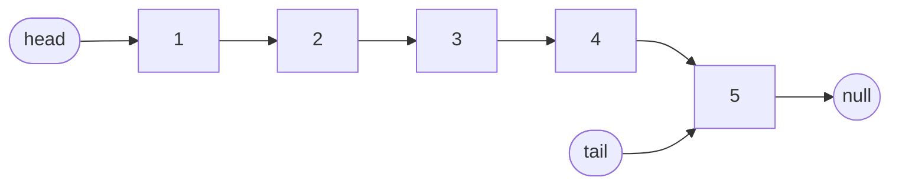

`reverse()` flips each `next` pointer using `prev / current / temp`:


### [DoublyLinkedList](linear/DoublyLinkedList.java)
Each `DNode` has `prev` and `next` (plus an optional `key` used by the LRU cache). Both `deleteFirst` and `deleteLast` are O(1).

```mermaid
flowchart LR
    NL((null)) <-- prev --- A[1]
    A <--> B[2] <--> C[3] <--> D[4]
    D -- next --> NR((null))
    H([head]) --> A
    T([tail]) --> D
```

### [Stack](linear/Stack.java)
LIFO, built on `LinkedList`: `push` = `insertFirst`, `pop` = `deleteFirst`. The head is the top.

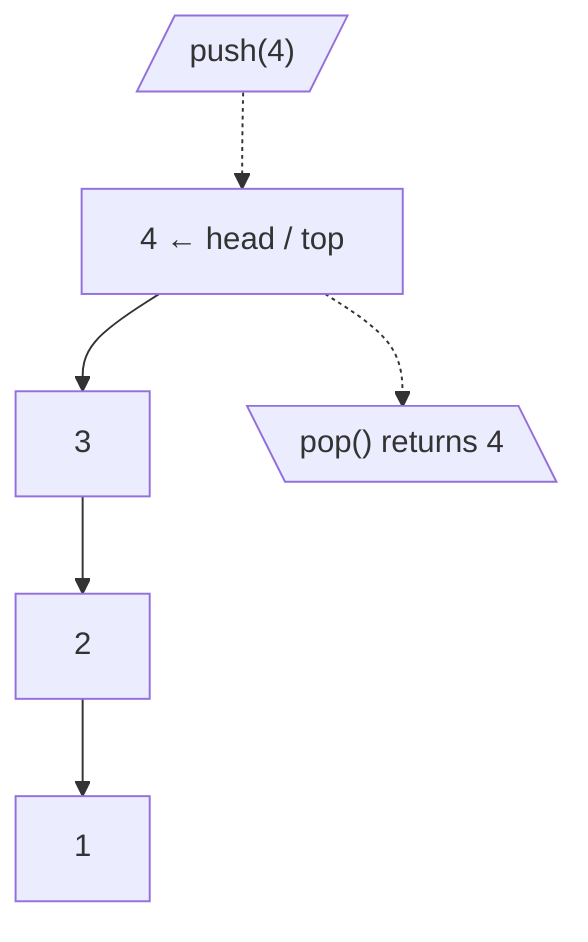

### [Queue](linear/Queue.java)
FIFO, built on `LinkedList`: `enqueue` = `insertLast` (tail), `dequeue` = `deleteFirst` (head).

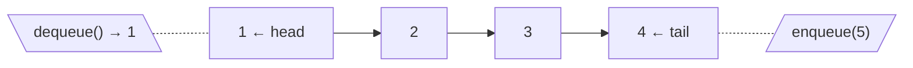

### [Dequeue](linear/Dequeue.java)
Double-ended queue on a `DoublyLinkedList`, so removing from either end is O(1).

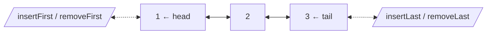

### [LRUCache](linear/LRUCache.java)
`HashMap<key, DNode>` gives O(1) lookup; the `DoublyLinkedList` keeps recency order. Head = most recently used, tail = next to evict.

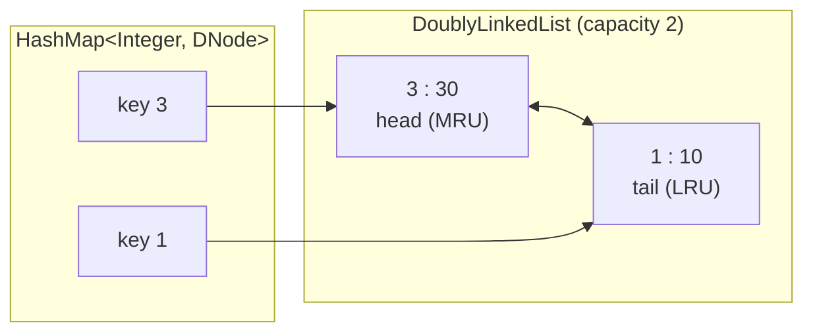

`get(1)` unlinks node 1 and moves it to the front; `set(4, 40)` at capacity evicts the tail:

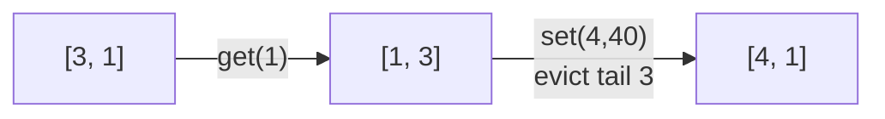

## Non Linear

### [Tree](nonlinear/Tree.java)
N-ary tree: every `TNode` holds a `List<TNode> children`. `search` is a DFS over all children.

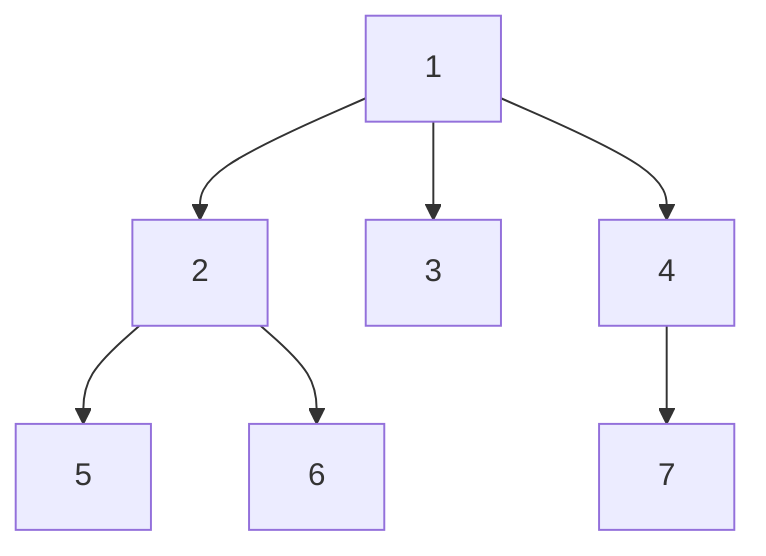

### [BinaryTree](nonlinear/BinaryTree.java)
At most two children (`left`, `right`), with an optional `parent` reference used for successor/predecessor.

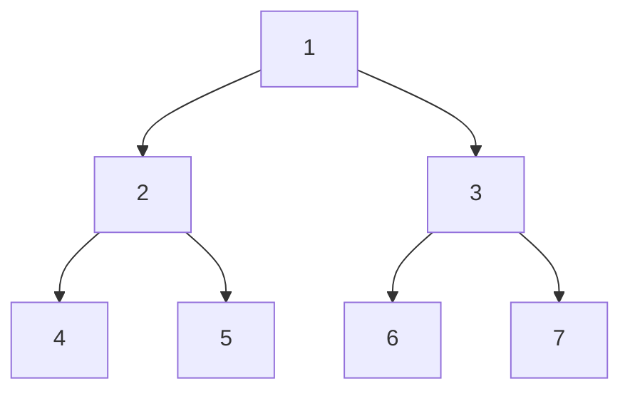

| Traversal | Order | Output for the tree above |
|---|---|---|
| In-order | Left → Root → Right | `4 2 5 1 6 3 7` |
| Pre-order | Root → Left → Right | `1 2 4 5 3 6 7` |
| Post-order | Left → Right → Root | `4 5 2 6 7 3 1` |
| Level order (BFS) | level by level | `1 2 3 4 5 6 7` |
| Spiral | alternate direction per level | `1 3 2 4 5 6 7` |
| Left view / Right view | first / last node per level | `1 2 4` / `1 3 7` |

LCA: `findLCA` returns the node where `n1` and `n2` split into different subtrees. `getLCA(4, 5) = 2`, `getLCA(4, 6) = 1`. Height = 3, diameter (in nodes) = 5.

### [BinarySearchTree](nonlinear/BinarySearchTree.java)
Invariant: `left < node < right`. Search, insert, and delete are O(h), where h is the tree's height. Highlighted: the path for `search(15)`.

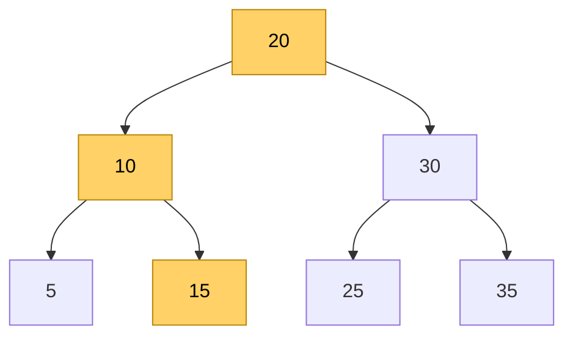

`delete` has three cases:

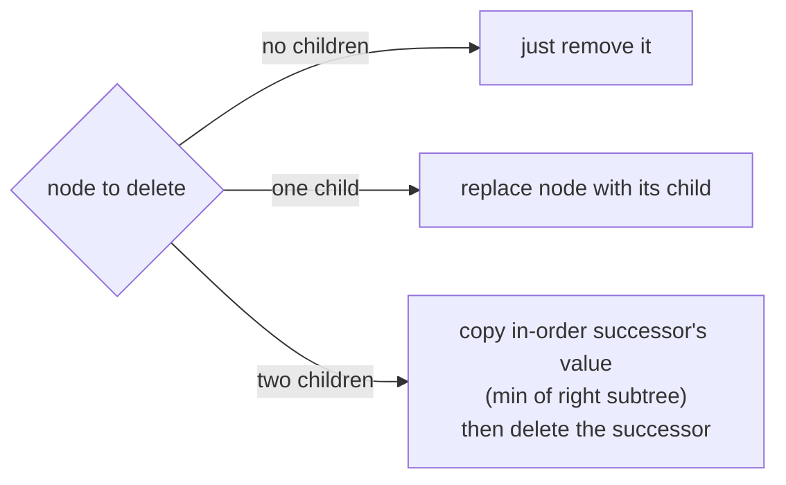

In-order successor, with parent pointers: if a right subtree exists, take its leftmost node; otherwise walk up until you arrive from a left child. Successor of 15 = **20**, successor of 35 = **null**.

### [Trie](nonlinear/Trie.java)
Each `TrieNode` maps `Character → TrieNode`; `isWord` marks where an inserted word ends. Shown after inserting `cat`, `car`, `card`, `dog`:

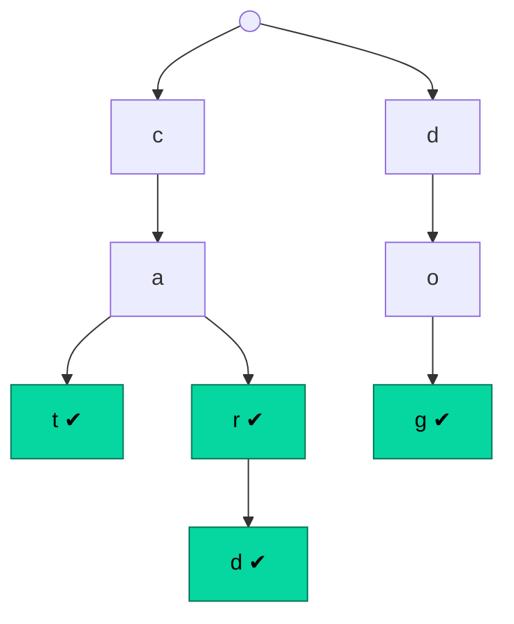

`search("ca")` → false (not `isWord`), `startsWith("ca")` → true.

### [BinaryHeap](nonlinear/BinaryHeap.java)
A complete binary tree stored in an array. For index `i`: parent `(i-1)/2`, left `2i+1`, right `2i+2`. Min-heap after inserting `10, 4, 9, 1, 7, 5, 3`:

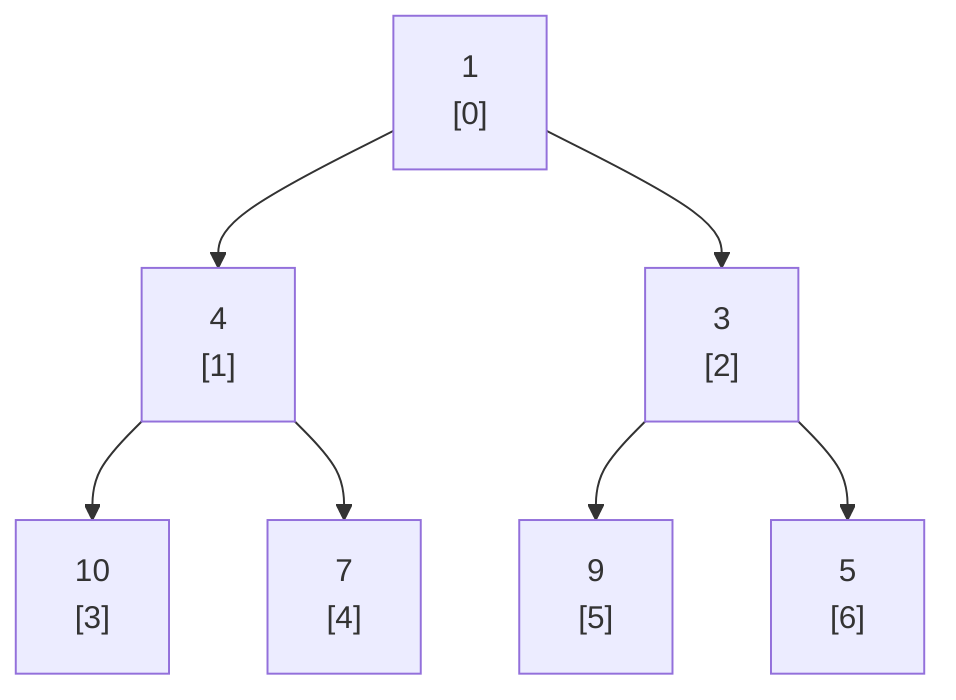

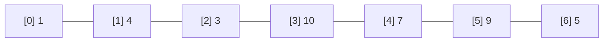

- `insert` → put at the end, **heapifyUp** (swap with parent while smaller).
- `extractMinOrMax` → swap root with last, shrink, **heapifyDown** (swap with the smaller child).

### [PriorityQueue](nonlinear/PriorityQueue.java)
A thin wrapper over `BinaryHeap`: highest-priority element always at the root.

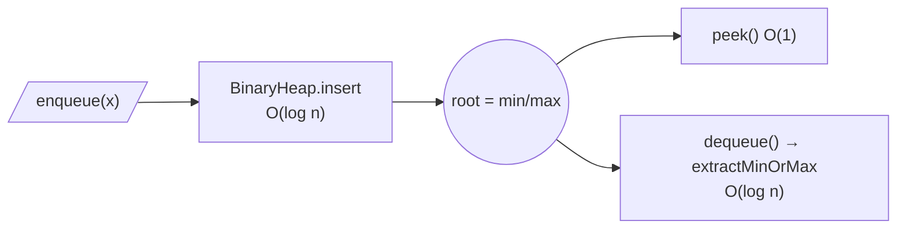

### [Graph](nonlinear/Graph.java)
Adjacency list: `nodes` is a `List<GraphNode>`, each with `neighbours` and a `weightsMap`. Shared DFS/BFS traversal and BFS cycle detection (a visited neighbour that isn't your parent means a cycle).

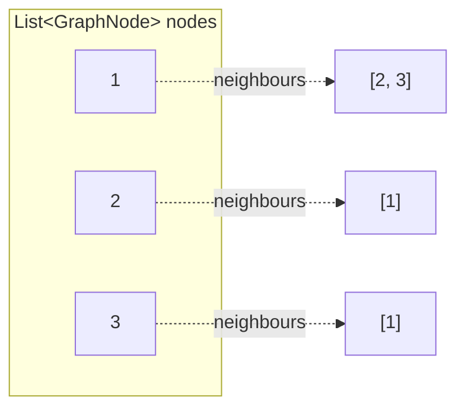

### [UndirectedGraph](nonlinear/UndirectedGraph.java)
`addEdge(v1, v2)` links both ways. `findShortestPath` is a BFS, so the distance = number of edges. From source **1**:

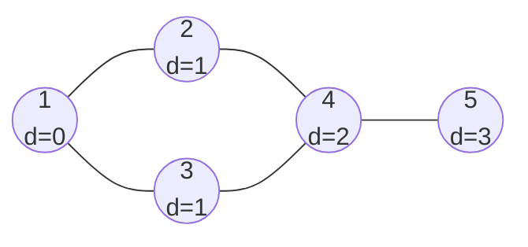

BFS order: `1 2 3 4 5`.

### [DirectedGraph](nonlinear/DirectedGraph.java)
**Cycle detection**: DFS with a `recursionStack`; reaching a node already on the stack = back edge = cycle.

**Topological sort** (Kahn's algorithm): repeatedly take vertices with in-degree 0. For the DAG in `main`:

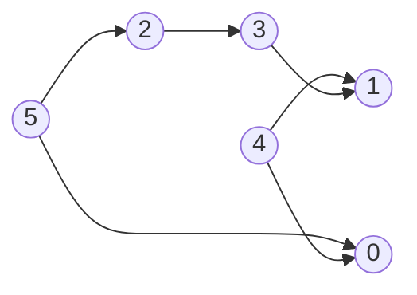

Order produced: `5 4 2 0 3 1`.

**Shortest paths** on the weighted graph from `main` (source `0`). Dijkstra (non-negative weights, min-heap) and Bellman-Ford (relax every edge V−1 times, handles negative weights) agree:

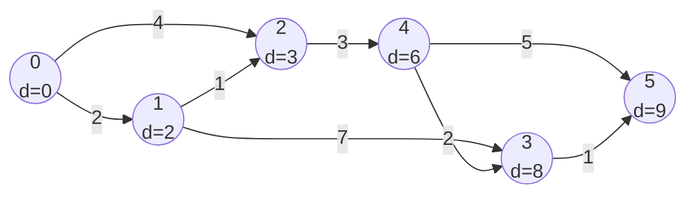

Shortest path to 5: `0 → 1 → 2 → 4 → 3 → 5` = 2+1+3+2+1 = **9**.

## Sorting
Every example below sorts `[5, 1, 4, 2]` and follows the steps of that file's implementation.

### [BubbleSort](sorting/BubbleSort.java)
Swap adjacent out-of-order pairs; each pass bubbles the largest remaining value to the end. O(n²) time, O(1) space.

```mermaid
flowchart LR
    S0["5 1 4 2"] -->|"pass 1"| S1["1 4 2 <b>5</b>"] -->|"pass 2"| S2["1 2 <b>4 5</b>"] -->|"pass 3"| S3["<b>1 2 4 5</b>"]
```

### [SelectionSort](sorting/SelectionSort.java)
This version finds the **max** of the unsorted range and swaps it to the right end. O(n²) time, O(1) space.

```mermaid
flowchart LR
    S0["5 1 4 2"] -->|"max 5 → end"| S1["2 1 4 <b>5</b>"] -->|"max 4 in place"| S2["2 1 <b>4 5</b>"] -->|"max 2 → idx 1"| S3["<b>1 2 4 5</b>"]
```

### [InsertionSort](sorting/InsertionSort.java)
Take `key = input[i]` and shift larger elements right until key fits. O(n²) worst, O(n) on nearly sorted input.

```mermaid
flowchart LR
    S0["5 | 1 4 2"] -->|"key 1"| S1["1 5 | 4 2"] -->|"key 4"| S2["1 4 5 | 2"] -->|"key 2"| S3["1 2 4 5"]
```

### [MergeSort](sorting/MergeSort.java)
Divide in half until single elements, then merge sorted halves. O(n log n) time, O(n) space.

```mermaid
flowchart TD
    A["5 1 4 2"] --> B["5 1"]
    A --> C["4 2"]
    B --> B1["5"]
    B --> B2["1"]
    C --> C1["4"]
    C --> C2["2"]
    B1 --> M1["1 5"]
    B2 --> M1
    C1 --> M2["2 4"]
    C2 --> M2
    M1 --> R["1 2 4 5"]
    M2 --> R
```

### [QuickSort](sorting/QuickSort.java)
Lomuto partition: pivot = last element; everything `<= pivot` moves left of index `i`, then the pivot is swapped into `i`. Average O(n log n), worst O(n²).

```mermaid
flowchart TD
    A["5 1 4 <b>2</b><br/>pivot 2"] -->|"partition → p=1"| B["1 | <b>2</b> | 4 5"]
    B --> L["[1]<br/>done"]
    B --> R["4 <b>5</b><br/>pivot 5"]
    R -->|"partition → p=3"| R2["4 | <b>5</b>"]
    L --> F["1 2 4 5"]
    R2 --> F
```

### [HeapSort](sorting/HeapSort.java)
Insert everything into a min `BinaryHeap`, then extract the min n times. O(n log n) time, O(n) extra space (this version is not in-place).

```mermaid
flowchart LR
    I["insert 5,1,4,2"] --> H["heap array<br/>1 2 4 5"]
    H -->|"extract 1"| H1["2 5 4"]
    H1 -->|"extract 2"| H2["4 5"]
    H2 -->|"extract 4"| H3["5"]
    H3 -->|"extract 5"| O["output<br/>1 2 4 5"]
```
