# Java Implementations of Fundamental Data Structures and Algorithms

## Linear

### [LinkedList](linear/LinkedList.java)


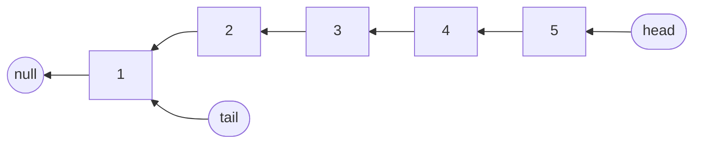

### [DoublyLinkedList](linear/DoublyLinkedList.java)
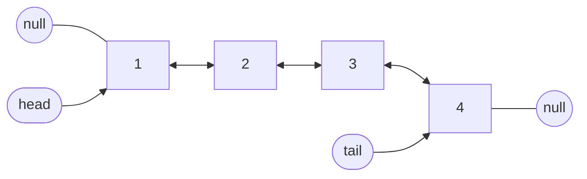

### [Stack](linear/Stack.java)
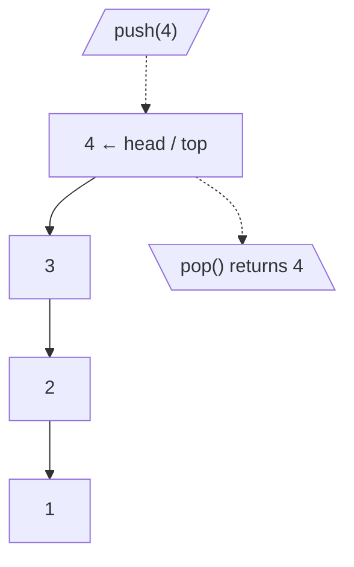

### [Queue](linear/Queue.java)
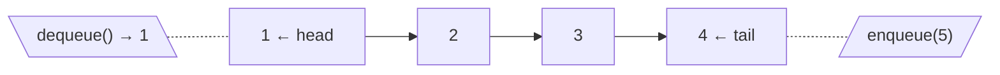

### [Dequeue](linear/Dequeue.java)
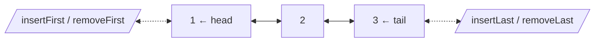

### [LRUCache](linear/LRUCache.java)
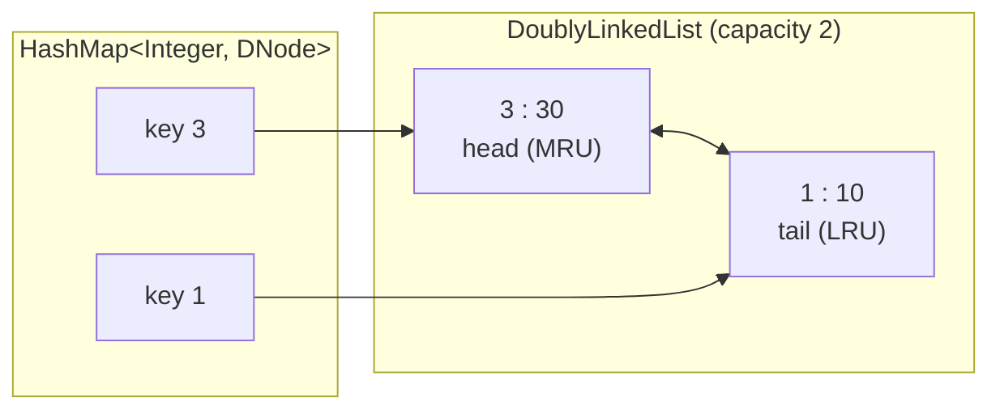

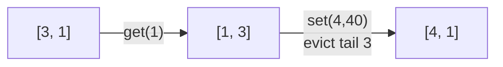

## Non Linear

### [Tree](nonlinear/Tree.java)
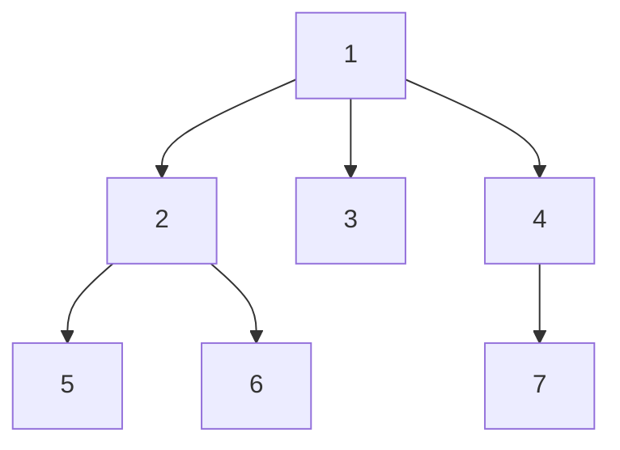

### [BinaryTree](nonlinear/BinaryTree.java)
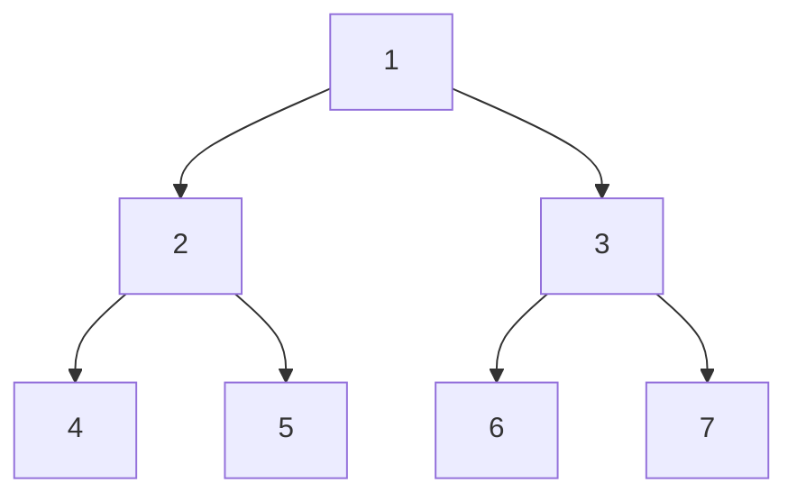

### [BinarySearchTree](nonlinear/BinarySearchTree.java)
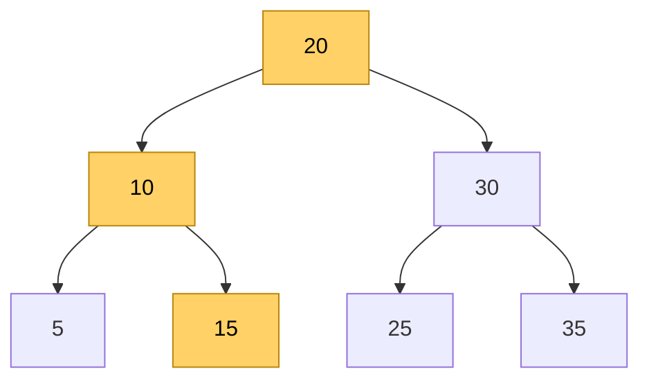

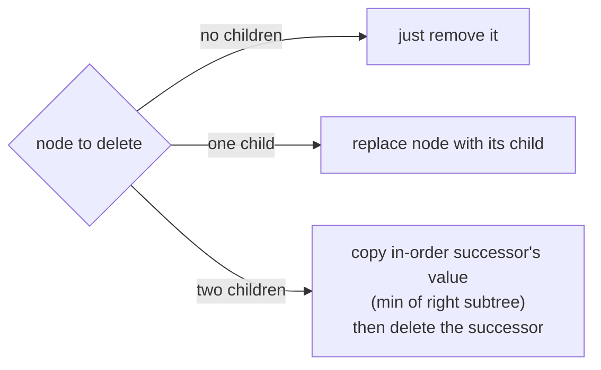

### [Trie](nonlinear/Trie.java)
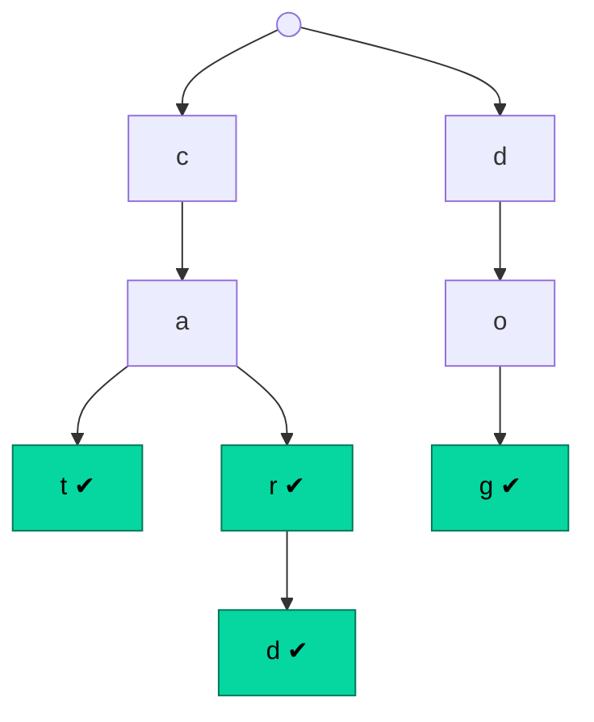

### [BinaryHeap](nonlinear/BinaryHeap.java)
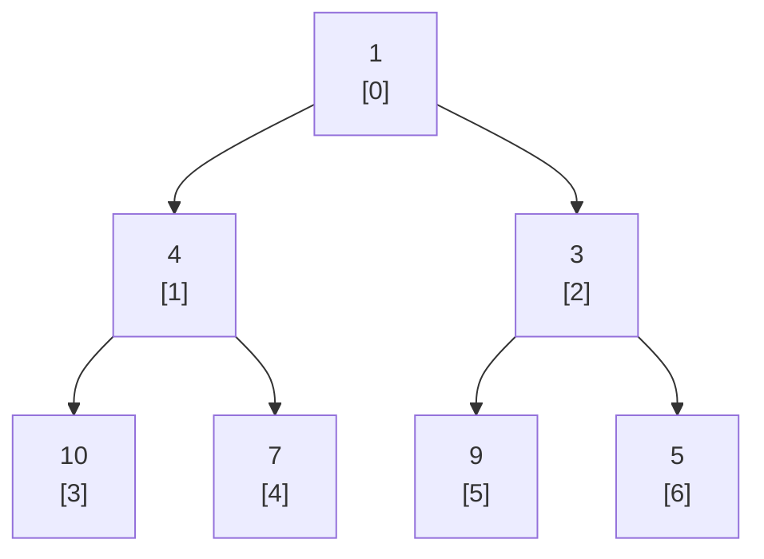

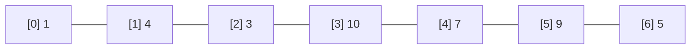

### [PriorityQueue](nonlinear/PriorityQueue.java)
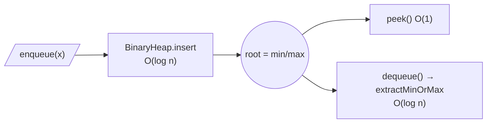

### [Graph](nonlinear/Graph.java)
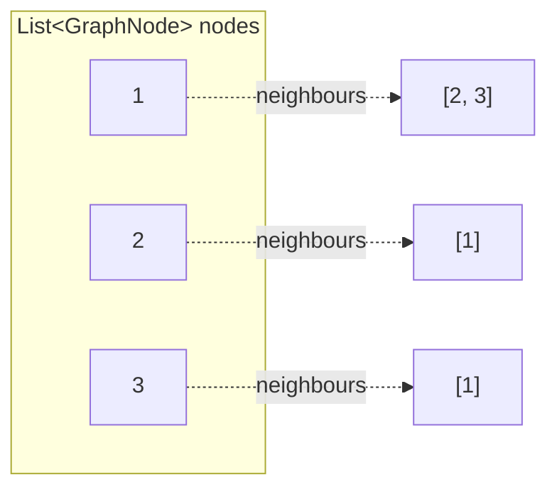

### [UndirectedGraph](nonlinear/UndirectedGraph.java)
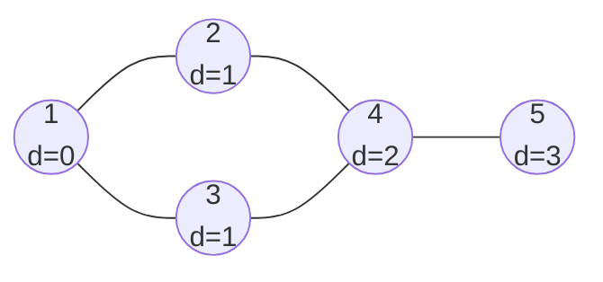

### [DirectedGraph](nonlinear/DirectedGraph.java)
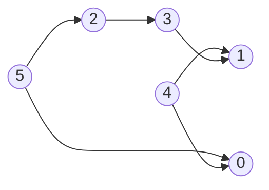

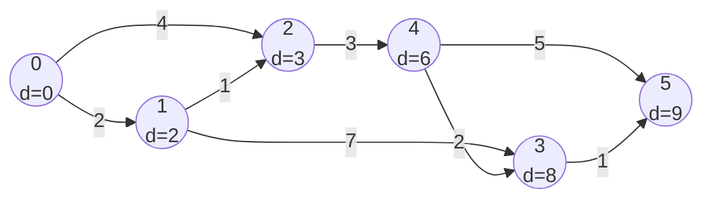

## Sorting

### [BubbleSort](sorting/BubbleSort.java)
```mermaid
flowchart LR
    S0["5 1 4 2"] -->|"pass 1"| S1["1 4 2 <b>5</b>"] -->|"pass 2"| S2["1 2 <b>4 5</b>"] -->|"pass 3"| S3["<b>1 2 4 5</b>"]
```

### [SelectionSort](sorting/SelectionSort.java)
```mermaid
flowchart LR
    S0["5 1 4 2"] -->|"max 5 → end"| S1["2 1 4 <b>5</b>"] -->|"max 4 in place"| S2["2 1 <b>4 5</b>"] -->|"max 2 → idx 1"| S3["<b>1 2 4 5</b>"]
```

### [InsertionSort](sorting/InsertionSort.java)
```mermaid
flowchart LR
    S0["5 | 1 4 2"] -->|"key 1"| S1["1 5 | 4 2"] -->|"key 4"| S2["1 4 5 | 2"] -->|"key 2"| S3["1 2 4 5"]
```

### [MergeSort](sorting/MergeSort.java)
```mermaid
flowchart TD
    A["5 1 4 2"] --> B["5 1"]
    A --> C["4 2"]
    B --> B1["5"]
    B --> B2["1"]
    C --> C1["4"]
    C --> C2["2"]
    B1 --> M1["1 5"]
    B2 --> M1
    C1 --> M2["2 4"]
    C2 --> M2
    M1 --> R["1 2 4 5"]
    M2 --> R
```

### [QuickSort](sorting/QuickSort.java)
```mermaid
flowchart TD
    A["5 1 4 <b>2</b><br/>pivot 2"] -->|"partition → p=1"| B["1 | <b>2</b> | 4 5"]
    B --> L["[1]<br/>done"]
    B --> R["4 <b>5</b><br/>pivot 5"]
    R -->|"partition → p=3"| R2["4 | <b>5</b>"]
    L --> F["1 2 4 5"]
    R2 --> F
```

### [HeapSort](sorting/HeapSort.java)
```mermaid
flowchart LR
    I["insert 5,1,4,2"] --> H["heap array<br/>1 2 4 5"]
    H -->|"extract 1"| H1["2 5 4"]
    H1 -->|"extract 2"| H2["4 5"]
    H2 -->|"extract 4"| H3["5"]
    H3 -->|"extract 5"| O["output<br/>1 2 4 5"]
```

